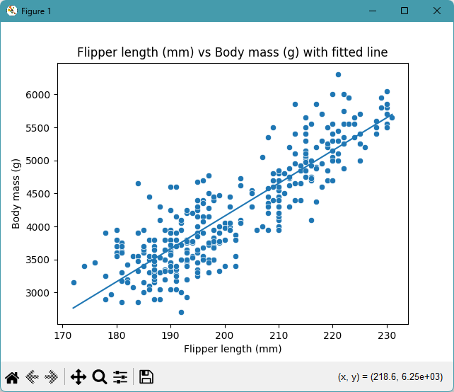
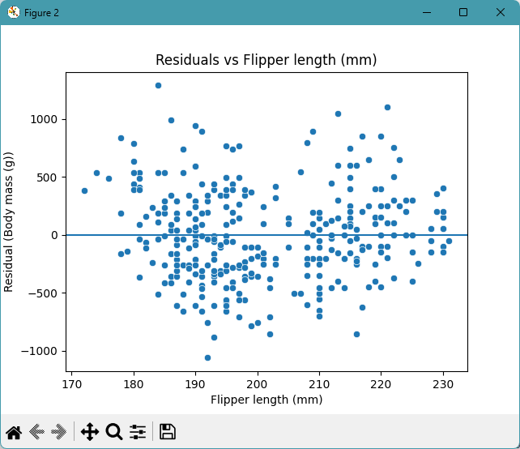
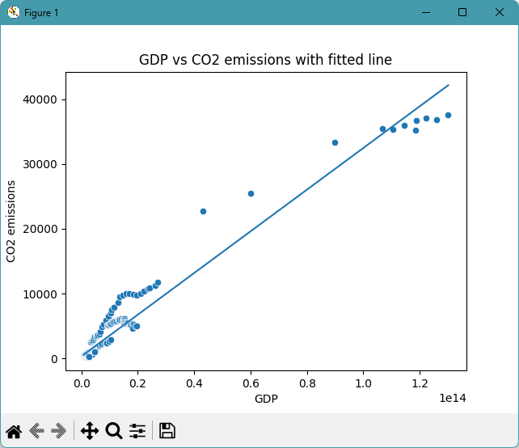
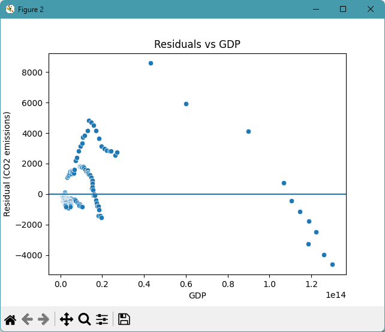

# datafun-07-regression

[](https://denisecase.github.io/pro-analytics-02/workflow-b-apply-example-project/)
[](./pyproject.toml)
[](./LICENSE)

> Professional Python project: linear regression and predictive analytics.

## Project Goal

This project introduces **linear regression**, the process of
fitting a model to data and using it to make predictions.

Think about two variables that might be related:

- Does study time predict exam scores?
- Does temperature predict energy usage?
- Does advertising spend predict revenue?

Your goal: run the example, read the code,
and apply the same approach to a dataset and question of your own choosing.

For data suggestions, please see [data/raw/README.md](data/raw/README.md).

## Working Files

You'll work with just these areas:

- **data/raw** - raw data for exploration
- **docs/** - project narrative and documentation
- **src/** - supporting Python package modules
- **notebooks/** - interactive analysis
- **pyproject.toml** - update authorship & links
- **zensical.toml** - update authorship & links

## Instructions (pro-analytics-02)

Follow the
[step-by-step workflow guide](https://denisecase.github.io/pro-analytics-02/workflow-b-apply-example-project/)
to complete:

1. Phase 1. **Start & Run**
2. Phase 2. **Change Authorship**
3. Phase 3. **Read & Understand**
4. Phase 4. **Modify**
5. Phase 5. **Apply**

## Challenges

Challenges are expected.
Sometimes instructions may not quite match your operating system.
When issues occur, share screenshots, error messages, and details about what you tried.
Working through issues is part of implementing professional projects.

## Success

After completing Phase 1. **Start & Run**, you'll have your own GitHub project,
running on your machine, and running the example will print out:

```shell
========================
Executed successfully!
========================
```

A new file `project.log` will appear in the root project folder.

## Command Reference

<details>
<summary>Show command reference</summary>

### In a machine terminal (open in your `Repos` folder)

After you get a copy of this repo in your own GitHub account,
open a machine terminal in your `Repos` folder:

```shell
# Replace username with YOUR GitHub username.
git clone https://github.com/hasacco/datafun-07-regression

cd datafun-07-regression
code .
```

### In a VS Code terminal

```shell
uv self update
uv python pin 3.14
uv lock --upgrade
uv sync --extra dev --extra docs --upgrade

uvx pre-commit install

git add -A
uvx pre-commit run --all-files
# repeat if changes were made
uvx pre-commit run --all-files

# run the penguin example: is there a linear relationship?
uv run python -m datafun.app_penguins_case

# run the co2 example: is there a linear relationship?
# the line fits poorly; why?  what would you change?
uv run python -m datafun.app_co2_case
uv run python -m datafun.app_co2_hasacco

# do chores
uv run python -m pyright
uv run python -m pytest
uv run python -m zensical build

# save progress
git add -A
git commit -m "update"
git push -u origin main
```

</details>

## Notes

- Use the **UP ARROW** and **DOWN ARROW** in the terminal to scroll through past commands.
- Use `CTRL+f` to find (and replace) text within a file.
- You do not need to add to or modify `tests/`. They are provided for example only.
- Many files are silent helpers. Explore as you like, but nothing is required.
- You do NOT not to understand everything; understanding builds naturally over time.

## Troubleshooting >>>

If you see something like this in your terminal: `>>>` or `...`
You accidentally started Python interactive mode.
It happens.
Press `Ctrl+c` (both keys together) or `Ctrl+Z` then `Enter` on Windows.

## Example Output

```shell
| INFO | P07 | ========================
| INFO | P07 | Dataset: owid-co2-data-subset
| INFO | P07 | Feature (x): gdp
| INFO | P07 | Target  (y): co2
| INFO | P07 | Original rows: 350
| INFO | P07 | Model rows:    308
| INFO | P07 | Fitted line:
| INFO | P07 |   co2 = 3.21582e-10 * gdp + 308.446
| INFO | P07 | ======================
| INFO | P07 | Review the fit numbers (R-squared, RMSE).
| INFO | P07 | Look at the fitted-line plot and the residual plot.
| INFO | P07 | Decide whether a straight line is a fair description here.
| INFO | P07 | If the residuals show a pattern, a straight line is not -
| INFO | P07 | and that is a real finding worth reporting.
| INFO | P07 | ======================
| INFO | P07 | Repeat with a different feature, or a transformed feature,
| INFO | P07 | to investigate other angles.
| INFO | P07 | ======================
| INFO | P07 | Include instructions and specifics in your README.md file.
| INFO | P07 | Write up your narrative on your docs/index.md file.
| INFO | P07 | Include your next step suggestions for further analysis or modeling.
| INFO | P07 | ======================
| INFO | P07 | ----- in a script, call plt.show() once at the end to display all charts -----
| INFO | P07 | ----- in a script, close the chart windows (with the close button) to continue  -----
| INFO | P07 | Linear regression workflow complete
| INFO | P07 | IMPORTANT: This script creates chart windows.
| INFO | P07 | Close any chart windows and terminate this process with CTRL+c as needed.
| INFO | P07 | ========================
| INFO | P07 | Executed successfully!
| INFO | P07 | ========================
```

## Findings and Visuals

Take screenshots of your charts and provide them here with a discussion.
In Markdown, display a figure by using:
an exclamation mark immediately followed by square brackets containing a useful caption
immediately followed by parentheses containing the relative path to your figure.
Note: When you start typing the path with a dot (.) for "here, in this directory",
the IDE may help complete the path.

In your custom project, discuss these examples, but

- your figures and narrative should reflect your work,
- this `README.md` should include your commands, process, and visuals, and
- `docs/index.md` should include your narrative.

Remove unnecessary instructional comments in your custom files.

Update these figures to present interesting results from your custom project:

## Penguins: Is there a linear relationship?





## World Data: Is there a linear relationship? How can you improve the analysis?





## Project Documentation

Additional instructions, terms, and project notes:

[docs/index.md](docs/index.md)

## Citation

[CITATION.cff](./CITATION.cff)

## License

[MIT](./LICENSE)

## Modification 6-23-26

For the modification, I chose to try different types of regressions on the CO2 data. The residuals from the linear regression showed clustering, so I chose to see if another type of regression fit the data better. I added an exponential regression and a logarithmic regression, as well as plots showing these functions graphed on the data and residuals of each type of regression. The exponential regression had a lower R-squared value than the linear regression, looked to be a worse fit, and still had clustered residuals. The logarithmic regression had an even lower R-squared value than the exponential regression, appeared to be a worse fit, and still had clustered residuals.

## Example Output 6-23-26

[Exponential Regression](/docs/images/Figure_3_hasacco_expreg.png)

[Exponential Regression Residuals](/docs/images/Figure_4_hasacco_expregresiduals.png)

[Logarithmic Regression](/docs/images/Figure_5_hasacco_logreg.png)

[Logarithmic Regression Residuals](/docs/images/Figure_5_hasacco_logreg.png)

```shell
2026-06-23 16:52:48 | INFO | P07 | --- Section 7: Examine the fit (residuals, R-squared, RMSE) ---
2026-06-23 16:52:48 | INFO | P07 | Computing residuals (actual - fitted)
2026-06-23 16:52:48 | INFO | P07 | Fit numbers (requires interpretation):
2026-06-23 16:52:48 | DEBUG | P07 |   R-squared: 0.9562
2026-06-23 16:52:48 | DEBUG | P07 |   RMSE:      1352.43  (in units of CO2 emissions)
2026-06-23 16:52:48 | DEBUG | P07 |   residual min:  -4622.56
2026-06-23 16:52:48 | DEBUG | P07 |   residual max:  8584.86
2026-06-23 16:52:48 | DEBUG | P07 |   residual mean: 5.90581e-14
2026-06-23 16:52:48 | INFO | P07 |
Linear Regression Fit Numbers (requires interpretation):
             R-squared is near 1, indicating the line accounts for most of the variation in y.
             Residual plot shows clustering of residuals, indicating a straight line is not the right description.

2026-06-23 16:52:48 | INFO | P07 | Computing residuals for the exponential fit
2026-06-23 16:52:48 | INFO | P07 | Exponential fit numbers (requires interpretation):
2026-06-23 16:52:48 | DEBUG | P07 |   co2 = 2229.28 * exp(0.0234479 * gdp)
2026-06-23 16:52:48 | DEBUG | P07 |   R-squared: 0.8030
2026-06-23 16:52:48 | DEBUG | P07 |   RMSE:      2869.13  (in units of CO2 emissions)
2026-06-23 16:52:48 | DEBUG | P07 |   residual min:  -9585.33
2026-06-23 16:52:48 | DEBUG | P07 |   residual max:  16617.2
2026-06-23 16:52:48 | DEBUG | P07 |   residual mean:  -407.977
2026-06-23 16:52:48 | INFO | P07 |
Exponential Regression Fit Numbers (requires interpretation):
             R-squared is farther from 1 than linear regression, indicating the curve accounts for a some of the variation in y.
             Residual plot shows clustering of residuals, indicating an exponential curve line is not the right description.

2026-06-23 16:52:48 | INFO | P07 | Computing residuals for the logarithmic fit
2026-06-23 16:52:48 | INFO | P07 | Logarithmic fit numbers (requires interpretation):
2026-06-23 16:52:48 | DEBUG | P07 |   co2 = 5301.81 * log(4.49518e-13 * gdp)
2026-06-23 16:52:48 | DEBUG | P07 |   R-squared: 0.6851
2026-06-23 16:52:48 | DEBUG | P07 |   RMSE:      3627.04  (in units of CO2 emissions)
2026-06-23 16:52:48 | DEBUG | P07 |   residual min:  -6452.09
2026-06-23 16:52:48 | DEBUG | P07 |   residual max:  15955.7
2026-06-23 16:52:48 | DEBUG | P07 |   residual mean:  1.43369e-06
2026-06-23 16:52:48 | INFO | P07 |
Logarithmic Regression Fit Numbers (requires interpretation):
             R-squared is far from 1, indicating the curve does not account for most of the variation in y.
             Residual plot shows clustering of residuals, indicating a logarithmic curve is not the right description.

2026-06-23 16:52:48 | INFO | P07 | --- Section 8: Charts ---
2026-06-23 16:52:48 | INFO | P07 | ---- Creating Scatter Plot with Fitted Line ----------
2026-06-23 16:52:48 | INFO | P07 | ----   Set x to GDP -----------------------
2026-06-23 16:52:48 | INFO | P07 | ----   Set y to CO2 emissions -------------------------
2026-06-23 16:52:48 | INFO | P07 | ------ Creating Residual Plot --------------------------
2026-06-23 16:52:48 | INFO | P07 | ------   Set x to GDP ----------------------
2026-06-23 16:52:48 | INFO | P07 | ------   Set y to the residual (actual - fitted) -------
2026-06-23 16:52:48 | INFO | P07 | ---- Creating Scatter Plot with Fitted Line ----------
2026-06-23 16:52:48 | INFO | P07 | ----   Set x to GDP -----------------------
2026-06-23 16:52:48 | INFO | P07 | ----   Set y to CO2 emissions -------------------------
2026-06-23 16:52:48 | INFO | P07 | ------ Creating Residual Plot --------------------------
2026-06-23 16:52:48 | INFO | P07 | ------   Set x to GDP ----------------------
2026-06-23 16:52:48 | INFO | P07 | ------   Set y to the residual (actual - fitted) -------
2026-06-23 16:52:48 | INFO | P07 | ---- Creating Scatter Plot with Fitted Line ----------
2026-06-23 16:52:48 | INFO | P07 | ----   Set x to GDP -----------------------
2026-06-23 16:52:48 | INFO | P07 | ----   Set y to CO2 emissions -------------------------
2026-06-23 16:52:48 | INFO | P07 | ------ Creating Residual Plot --------------------------
2026-06-23 16:52:48 | INFO | P07 | ------   Set x to GDP ----------------------
2026-06-23 16:52:48 | INFO | P07 | ------   Set y to the residual (actual - fitted) -------
2026-06-23 16:52:49 | INFO | P07 | --- Section 9: Summary and next steps ---
2026-06-23 16:52:49 | INFO | P07 | ========================
2026-06-23 16:52:49 | INFO | P07 | SUMMARY
2026-06-23 16:52:49 | INFO | P07 | ========================
2026-06-23 16:52:49 | INFO | P07 | Dataset: owid-co2-data-subset
2026-06-23 16:52:49 | INFO | P07 | Feature (x): gdp
2026-06-23 16:52:49 | INFO | P07 | Target  (y): co2
2026-06-23 16:52:49 | INFO | P07 | Original rows: 350
2026-06-23 16:52:49 | INFO | P07 | Model rows:    308
2026-06-23 16:52:49 | INFO | P07 | Fitted line:
2026-06-23 16:52:49 | INFO | P07 |   co2 = 3.21582e-10 * gdp + 308.446
2026-06-23 16:52:49 | INFO | P07 | ======================
2026-06-23 16:52:49 | INFO | P07 | Review the fit numbers (R-squared, RMSE).
2026-06-23 16:52:49 | INFO | P07 | Look at the fitted-line plot and the residual plot.
2026-06-23 16:52:49 | INFO | P07 | Decide if a `straight line` is a fair description.
2026-06-23 16:52:49 | INFO | P07 | If the residuals DO show a pattern (e.g. curve, funnel, clusters),
2026-06-23 16:52:49 | INFO | P07 | then a straight line is NOT a good description.
2026-06-23 16:52:49 | INFO | P07 | If the residuals DO NOT show a pattern,
2026-06-23 16:52:49 | INFO | P07 | then a straight line MIGHT be a good description.
2026-06-23 16:52:49 | INFO | P07 | Either way, the findings may be valuable.
2026-06-23 16:52:49 | INFO | P07 | ======================
2026-06-23 16:52:49 | INFO | P07 | Repeat with a different feature, or a transformed feature,
2026-06-23 16:52:49 | INFO | P07 | to investigate other options.
2026-06-23 16:52:49 | INFO | P07 | ======================
2026-06-23 16:52:49 | INFO | P07 | Include instructions and specifics in your README.md file.
2026-06-23 16:52:49 | INFO | P07 | Write up your narrative on your docs/index.md file.
2026-06-23 16:52:49 | INFO | P07 | Include your next step suggestions for further analysis or modeling.
2026-06-23 16:52:49 | INFO | P07 | ======================
2026-06-23 16:52:49 | INFO | P07 | ----- in a script, call plt.show() once at the end to display all charts -----
2026-06-23 16:52:49 | INFO | P07 | ----- in a script, close the chart windows (with the close button) to continue  -----
2026-06-23 16:52:52 | INFO | P07 | Regression workflow complete
2026-06-23 16:52:52 | INFO | P07 | IMPORTANT: This script creates chart windows.
2026-06-23 16:52:52 | INFO | P07 | Close any chart windows and terminate this process with CTRL+c as needed.
2026-06-23 16:52:52 | INFO | P07 | ========================
2026-06-23 16:52:52 | INFO | P07 | Executed successfully!
2026-06-23 16:52:52 | INFO | P07 | ========================
```
